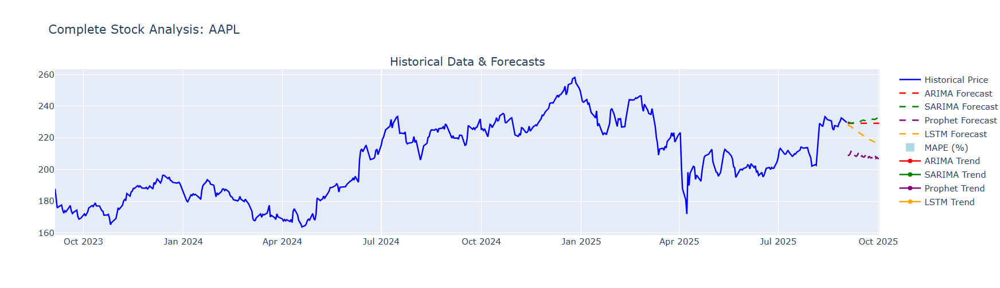

# StockVision: Market Forecasting & Insights Dashboard

**StockVision** is an advanced, data-driven dashboard for stock market forecasting and trend analysis. It empowers users to explore historical price behavior, analyze technical patterns, and predict future movements using a suite of statistical, machine learning, and deep learning approaches—all within an interactive web application.

---

## 🚀 Why StockVision?

Financial markets are dynamic and often volatile. While traditional models might overlook hidden trends, advanced techniques are challenging to implement. **StockVision** closes this gap by offering:

- **📊 Unified Dashboard:** Analyze and forecast stocks in one place.
- **⚡ Multiple Models:** Compare ARIMA, SARIMA, Prophet, and LSTM forecasts side by side.
- **🖥️ Interactive Visualization:** Make decisions with rich, intuitive charts.
- **🔮 Automated Model Selection:** Highlights the best prediction based on performance metrics.

---

## Tools & Libraries

- **Data Access:** [yfinance](https://github.com/ranaroussi/yfinance)
- **Dashboard:** [Streamlit](https://streamlit.io/)
- **Visualization:** [Plotly](https://plotly.com/python/)
- **Statistical Models:** ARIMA, SARIMA via [statsmodels](https://www.statsmodels.org/)
- **Machine Learning:** [Prophet](https://facebook.github.io/prophet/)
- **Deep Learning:** LSTM via [TensorFlow/Keras](https://www.tensorflow.org/)
- **Evaluation Metrics:** [Scikit-learn](https://scikit-learn.org/) (RMSE, MAPE)

---

## 📂 Workflow Overview

1. **Input:** Select a stock ticker (e.g., `MSFT`, `AMZN`) and date range.
2. **Processing:** Fetch and preprocess historical data.
3. **Analysis:** Visualize price trends, volume, and technical indicators.
4. **Forecasting:** Generate predictions using:
    - ARIMA
    - SARIMA
    - Prophet
    - LSTM
5. **Comparison:** Plot and evaluate forecasts with RMSE, MAPE.
6. **Insights:** Recommend the most reliable forecast.

---

## 🌟 Key Features

- **Historical Explorer:** Visualizes closing prices and trading volume.
- **Forecast Generator:** Predicts future stock price movements with multiple models.
- **Model Evaluation:** Compares accuracy across forecasting methods.
- **Customization:** User-defined ticker, date range, and forecast horizon.
- **Decomposition & Testing:** Includes seasonal decomposition and ADF stationarity tests.

---

## Example Dashboard




---

## 🛠️ Getting Started

### Installation

```sh
# Clone the repository
git clone https://github.com/manjula829/stock-market-forecasting.git
cd stock-market-forecasting

# Install core & optional dependencies
pip install pandas numpy matplotlib seaborn plotly yfinance prophet statsmodels scikit-learn tensorflow streamlit pyngrok
```

### Requirements

The following Python libraries are required:

#### Core:- pandas, numpy
#### Visualization:- matplotlib, seaborn, plotly
#### Data Fetching:- yfinance
#### Forecasting Models:- prophet, statsmodels
#### Machine Learning / Deep Learning:- scikit-learn, tensorflow
#### Dashboard:- streamlit
#### Optional (for running in Colab / public sharing):- pyngrok
Python 3.9+ is recommended.

---

##  Roadmap

- Integrate Transformer-based forecasting models
- Support analysis for multiple stocks simultaneously
- Deploy publicly (Heroku, AWS, etc.)
- Add real-time data streaming
- Integrate portfolio performance analytics

---

## 🙌 Credits

- **Data:** Yahoo Finance via `yfinance`
- **Visualization:** Plotly, Streamlit
- **Models:** Prophet, Statsmodels, TensorFlow/Keras

---

## ⚠️ Disclaimer

This project is intended solely for educational and research purposes. Stock market forecasts involve uncertainty and should not be interpreted as financial advice. Please conduct your own research and consult professional advisors before making investment decisions.
